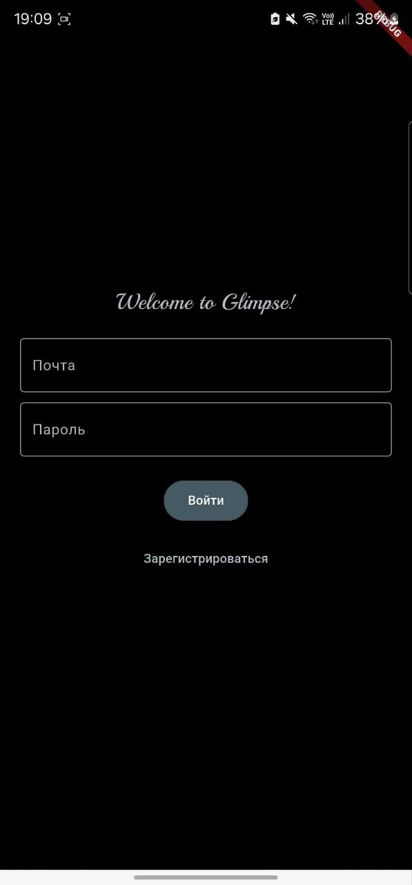
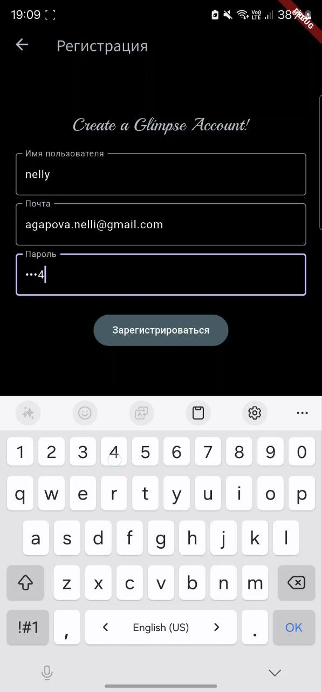
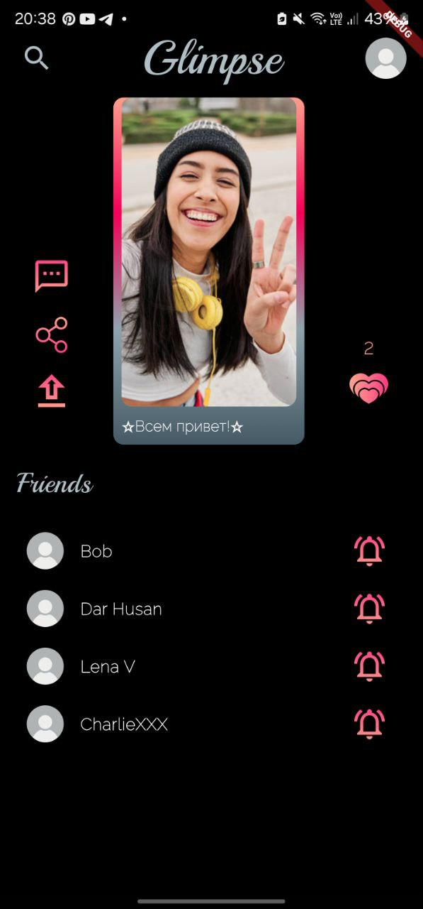
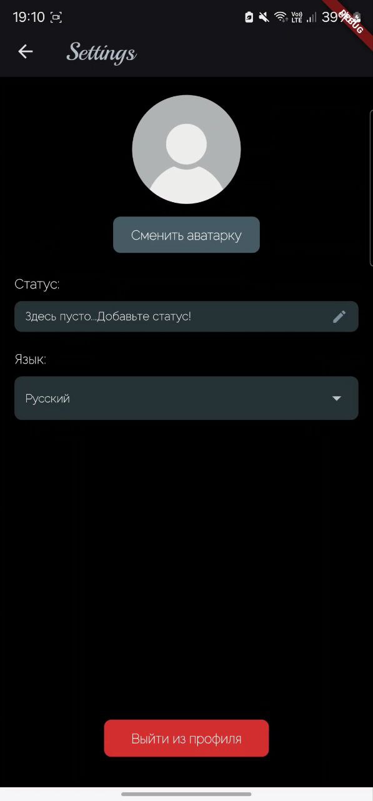
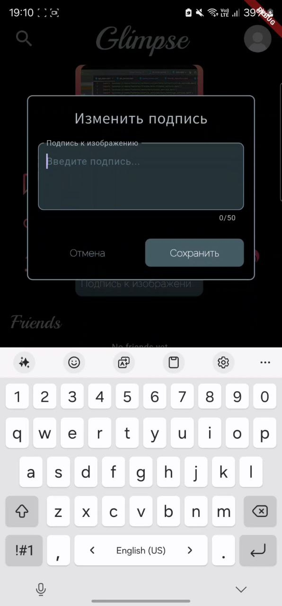
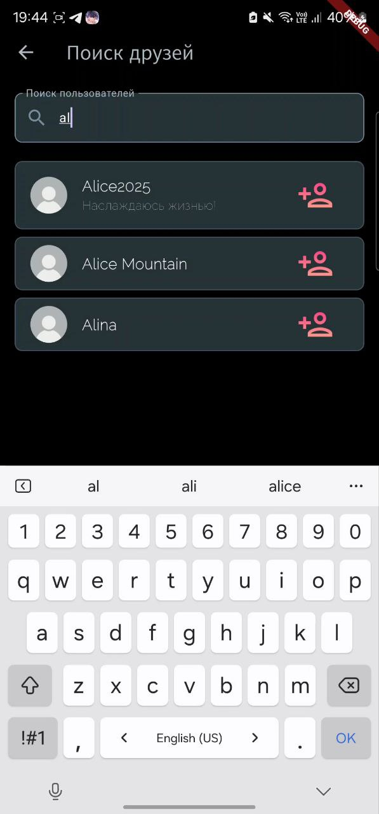

# Glimpse

Mобильное приложение **Glimpse** позволяет пользователям делиться моментальными фотографиями без фильтров и эффектов, создавая атмосферу аутентичности и спонтанности в противовес культуре идеализированного контента. Приложение поощряет естественность, минимизирует социальное давление и возвращает радость от подлинного взаимодействия между людьми!
## Содержание
-   [Функциональность](#функциональность)
-   [Экраны](#Экраны)
-   [Стек технологий](#стек)

## Функциональность

1. Создание ежедневной публикации через камеру устройства
2. Добавление краткой подписи к фотографии
3. Лайки и комментарии для выражения одобрения
4. Сохранение и обмен публикациями
5. Поиск других пользователей по никнейму
6. Система взаимных подписок для формирования круга друзей

## Экраны

### Экран аутентификации

### Экран регистрации

### Главный экран

### Экран настроек

### Возможность изменить статус

### Демонстрация работы поиска

## Стек
-   **Frontend:** [Flutter](https://flutter.dev/), [Dart](https://dart.dev/)
-   **Backend:** [Python](https://www.python.org/), [Flask](https://flask.palletsprojects.com/en/stable/), [SQLAlchemy](https://www.sqlalchemy.org/), [JWT](https://www.jwt.io/)
-   **Database:** [SQLite](https://www.sqlite.org/)
